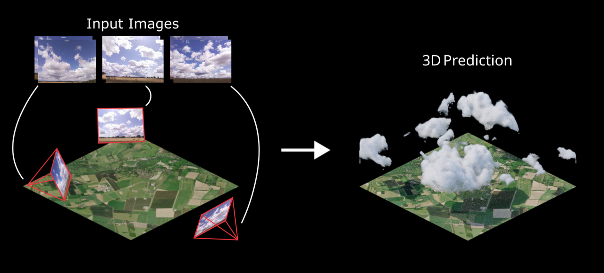

# Cloud4D: Estimating Cloud Properties at a High Spatial and Temporal Resolution
Official implementation of *Cloud4D: Estimating Cloud Properties at a High Spatial and Temporal Resolution*, NeurIPS 2025 (Spotlight)



[[arXiv](https://arxiv.org/abs/2511.19431v2)] [[Webpage](https://cloud4d.jacob-lin.com/)] [[Data](https://huggingface.co/datasets/jacoblin/cloud4d)]

[Jacob Lin](https://www.jacob-lin.com/), [Edward Gryspeerdt](https://profiles.imperial.ac.uk/e.gryspeerdt), [Ronald Clark](https://ronnie-clark.co.uk/)

## Setup

### Requirements

- Python 3.10+
- CUDA 12.4+ compatible GPU
- [uv](https://github.com/astral-sh/uv) package manager

### Installation

1. Create and activate a virtual environment with uv:

```bash
uv venv .venv --python 3.11
source .venv/bin/activate
```

2. Install PyTorch with CUDA support:

```bash
uv pip install torch torchvision --index-url https://download.pytorch.org/whl/cu128
```

3. Install remaining dependencies:

```bash
uv pip install -r requirements.txt
```

Note: The `spconv-cu124` package in requirements.txt is compatible with CUDA 12.x. If you have a different CUDA version, install the appropriate spconv package (e.g., `spconv-cu118` for CUDA 11.8).

## Usage

### Training

Training uses [Accelerate](https://huggingface.co/docs/accelerate) for multi-GPU support. The `deepspeed_config.yaml` at the project root configures the number of GPUs and distributed backend.

All commands are run from the project root with `accelerate launch --config_file deepspeed_config.yaml`.

**Step 1: Pretrain on Terragen Data**

```bash
accelerate launch --config_file deepspeed_config.yaml src/train.py \
    --pretrain \
    --stage 1 \
    --lr 1e-4 \
    --data_dir /path/to/terragen/data \
    --volume_dir /path/to/terragen/volumes \
    --steps 20000 \
    --checkpoint_path ./checkpoints/stage1_pretrain
```

The `--pretrain` flag configures the data loader for Terragen's data format and applies appropriate volume density scaling.

**Step 2: Fine-tune on LES Data**

Resume training on LES data using the pretrained checkpoint:

```bash
accelerate launch --config_file deepspeed_config.yaml src/train.py \
    --stage 1 \
    --lr 1e-5 \
    --data_dir /path/to/les/data \
    --volume_dir /path/to/les/volumes \
    --stage1_checkpoint ./checkpoints/stage1_pretrain/stage1_model_20000.pth \
    --steps 40000 \
    --checkpoint_path ./checkpoints/stage1_les
```

**Step 3: Train Stage 2 on LES Data**

Train the 3D refinement stage using the fine-tuned Stage 1 checkpoint:

```bash
accelerate launch --config_file deepspeed_config.yaml src/train.py \
    --stage 2 \
    --lr 1e-5 \
    --data_dir /path/to/les/data \
    --volume_dir /path/to/les/volumes \
    --stage1_checkpoint ./checkpoints/stage1_les/stage1_model_40000.pth \
    --steps 30000 \
    --checkpoint_path ./checkpoints/stage2_les
```

#### GPU configuration

Edit `deepspeed_config.yaml` to change the number of GPUs:

```yaml
num_processes: 4  # set to the number of GPUs available
```

### Command Line Arguments

| Argument | Description | Default |
|----------|-------------|---------|
| `--stage` | Training stage (1: 2D cloud, 2: 3D refine) | Required |
| `--data_dir` | Path to camera/image data directory | None |
| `--volume_dir` | Path to volume data directory | None |
| `--batch_size` | Training batch size | 1 |
| `--steps` | Number of training steps | 50000 |
| `--lr` | Learning rate | 1e-5 |
| `--checkpoint_path` | Directory to save checkpoints | checkpoints |
| `--stage1_checkpoint` | Path to stage 1 checkpoint (for stage 2 or LES fine-tuning) | None |
| `--pretrain` | Use Terragen synthetic data configuration | False |
| `--cbh_lambda` | Weight for cloud base height loss | 0.1 |
| `--delta_height_lambda` | Weight for delta height loss | 0.1 |
| `--lwp_lambda` | Weight for liquid water path loss | 1.0 |


## Citation

```bibtex
@inproceedings{
      lin2025cloudd,
      title={Cloud4D: Estimating Cloud Properties at a High Spatial and Temporal Resolution},
      author={Jacob Lin and Edward Gryspeerdt and Ronald Clark},
      booktitle={The Thirty-ninth Annual Conference on Neural Information Processing Systems},
      year={2025},
      url={https://openreview.net/forum?id=g2AAvmBwkS}
      }
```